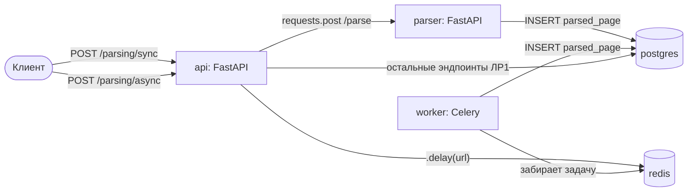

# ЛР3 — Обзор

**Тема:** «Упаковка FastAPI-приложения в Docker, работа с источниками
данных и очередью». Продолжение проекта [Bookcrossing](../report/overview.md)
(ЛР1) и [ЛР2](../lab2/overview.md) — контейнеризуется то же приложение,
та же база данных, и в Docker переезжает тот же парсер, что был написан
в ЛР2 (`requests` + `BeautifulSoup`).

## Что нужно было сделать

Три подзадачи, первые две — обязательный минимум (70%), все три — 100%:

1. **Упаковать в Docker** FastAPI-приложение, базу данных и парсер;
   парсер должен быть доступен по HTTP из отдельного контейнера.
2. **Вызвать парсер из основного приложения по HTTP** — клиент
   отправляет URL в основное API, оно синхронно обращается к
   контейнеру с парсером и возвращает результат клиенту.
3. **Вызвать парсер через очередь задач** (Celery + Redis) — основное
   API ставит задачу в очередь и сразу отвечает клиенту, не дожидаясь
   выполнения; отдельный Celery-воркер разбирает очередь в фоне.

## Архитектура

Единая кодовая база (`bookcrossing/`), пять контейнеров в
`docker-compose.yml`:

| Сервис   | Образ / сборка                        | Роль                                             | Порт   |
|----------|----------------------------------------|---------------------------------------------------|:------:|
| `db`     | `postgres:16-alpine`                   | общая база данных                                  | —      |
| `redis`  | `redis:7-alpine`                       | брокер и backend результатов Celery                | —      |
| `api`    | `Dockerfile`                           | основное FastAPI-приложение (ЛР1 + новый роутер)   | 8000   |
| `parser` | `parser_service/Dockerfile`            | отдельное FastAPI-приложение-парсер                | 8001   |
| `worker` | `Dockerfile`, `command: celery ...`    | Celery-воркер, разбирает очередь из `redis`        | —      |



## Общая логика парсинга — без дублирования кода

И HTTP-сервис (`parser`), и Celery-задача (`worker`) должны делать одно
и то же: скачать страницу и достать `<title>` (то же самое, что в ЛР2).
Чтобы не копировать код парсинга в два места, он вынесен в один общий
модуль [`app/parsing/service.py`](https://github.com/Tttnya/ITMO_ICT_WebDevelopment_tools_2025-2026/blob/main/students/K3441/Tsvetkova_Tatyana/Lr3/app/parsing/service.py)
и переиспользуется обоими путями — они отличаются только значением
поля `approach` (`sync-service` / `celery`), которое пишется вместе с
результатом в таблицу `parsed_page` (та же модель, что заводилась в ЛР2,
теперь она часть основной схемы приложения — `app/models.py`).

## Структура добавленных файлов

```
bookcrossing/
├── Dockerfile                  # образ api / worker
├── entrypoint.sh               # накатывает Alembic-миграции перед стартом
├── docker-compose.yml          # db, redis, api, parser, worker
├── .dockerignore
├── app/
│   ├── celery_app.py           # конфигурация Celery (брокер/backend — Redis)
│   ├── models.py                (+ таблица ParsedPage)
│   └── parsing/
│       ├── service.py          # общая логика: requests + BeautifulSoup + запись в БД
│       ├── schemas.py          # Pydantic-схемы запросов/ответов
│       ├── router.py           # /parsing/sync, /parsing/async, /parsing/async/{id}
│       └── tasks.py            # Celery-задача parse_url_task
└── parser_service/
    ├── main.py                 # отдельное FastAPI-приложение (POST /parse)
    └── Dockerfile
```

Подробности — на страницах [Подзадача 1](task1.md), [Подзадача 2](task2.md),
[Подзадача 3](task3.md), команды запуска — на странице [Запуск](run.md).
